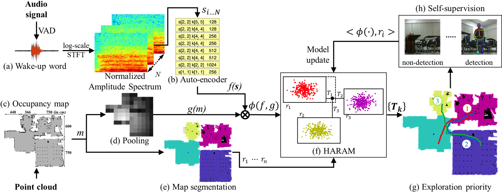

# Complex Indoor Environment Sound Source Localization (CIESSL)

[](https://travis-ci.com/TooSchoolForCool/CIESSL-py) 

This repo implements a self-supervised incremental learning framework which performs sound source localization in complex indoor environment with the help of a microphone array and the knowledge of the room structure (which is obtained by SLAM). 

*Note: This repo is developed under **ubuntu 16.04** with **python 2.7**, other ubuntu distribution may also be compatible.*

## 1. Installation

Before installing this package, several system dependencies need to be installed

```bash
sudo apt-get install python-pyaudio libsamplerate0 portaudio19-dev python-tk python-opencv
sudo pip install wheel
```

For Python dependencies, Python virtual environment [Virtualenv](https://virtualenv.pypa.io/en/stable/) or [virtualenvwrapper](https://virtualenvwrapper.readthedocs.io/en/latest/) is highly recommended. For installation detail, please follow the link above to install the python virtual environment.

Then [PyTorch](https://pytorch.org) needs to be installed, for the use of [ciessl_app](ciessl_app). In this repo, we adopt PyTorch-0.4.1. Try following command to install the PyTorch (Note: to support PyTorch with CUDA acceleration, different commands should be used)

```bash
pip install http://download.pytorch.org/whl/cpu/torch-0.4.1-cp27-cp27mu-linux_x86_64.whl
pip install torchvision
```

To support processing audio sources (i.e., microphone array, wave file ...), a python package [voice_engine](#2-voice-engine) has been developed. Then use following command to install this package

```bash
python setup.py bdist_wheel
pip install dist/*.whl
```

## 2. Voice Engine

[voice_engine](voice_engine) is a python package that handles audio sources processing. It includes acquiring data from a microphone array, reading/writing data from/to a .wav file, resampling signal data, Voice Activity Detection (VAD), calculating [GCC-PHAT](http://www.xavieranguera.com/phdthesis/node92.html) Cross-Correlation and Short Time Fourier Transform (STFT). For using the voice engine, several [examples](examples) are provided.

## 3. Sound Source Localization (SSL)

The **core** part of this project is implemented in [ciessl_app](ciessl_app) where we implement the self-supervised incremental learning framework. The whole framework workflow is illustrated in the figure below. 



The proposed approach using a self-supervised incremental learning scheme. (a) The multi-channel signals from the user’s wake-up word are picked up by VAD. Each signal is transferred to the amplitude spectrum and normalized to [0, 1], from which (b) an auto-encoder is trained to extract implicit features. Each block represents a 2D convolution with stride s[·, ·], kernel size k[·, ·] and the number of channels. In addition, (c) an occupancy map obtained from the reconstructed point cloud is down-sampled by pooling (d). (b)(d) together form the feature for learning. (e) Individual rooms are segmented from the point cloud. (f) The HARAM model is adopted to predict the priority rank of rooms the robot should visit. (g) The robot self-supervises the learning by exploring the rooms. (h) The exploration will be labeled as the positive sample if the robot detects the user, which will update the HARAM model incrementally.

## 4. Usage

Some usage examples are listed in the [Makefile](Makefile), please go and check it out.

Here are some instructions for launching/running the whole pipeline (i.e., the self-supervised incremental learning framework). The boot-up program is implemented in [ciessl_app/train.py](ciessl_app/train.py) through which we can launch the whole pipeline. 

Before we boot-up the whole pipeline, several things are need to be provided,

- **Voice data** in form of .pickle, the file name is named after `<frequency>-<sample_idx>-<mic_room_idx>-<dummy>-<voice_idx>.pickle` where 

  - *frequency* specified the voice signal frequency
  - *sample_idx* specified the index of the voice sample
  - *mic_room_idx* specified the microphone room index
  - *dummy* which is a redundant data
  - *voice_idx* specified the index of the voice sample in current sample index. 

  The voice data itself is store in form of a np.ndarray (n_frames, n_channels)

- **Map data** which should be store in a JSON file. The json file should contain following key,
  - n_rooms: number of rooms
  - room_centers: the coordinates of the center of each segmented room
  - boundary: the coordinate of the boundary of indoor environment
  - resolution: the resolution of the data, meter/pixel
  - origin: the origin coordinate of the room
  - map: segmented map of the environment
- **Configuration file** provides the coordinate information and room label for each data sample (both source location and mic location)
- **Encoder Model (optional)**: if an autoencoder is adopted in the pipeline, you need to specify the directory to a autoencoder config file where autoencoder initialization params and weights are stored in a JSON format

Here is an example for booting up the pipeline,

```makefile
python ciessl_app/train.py --voice_data="data/hand_vad_pickle/test/3Room" --map_data="data/map/bh9f_lab_map.json" --config="ciessl_app/config/bh9f_3room.json" --mode="rl" --voice_feature="conv_enc" --model_type="haram" --voice_encoder="./data/model/stft_cae_subset_256.json" --map_feature="flooding" --n_mic=16 --lm_param=0.965 --save_train_hist="HARAM+AE" --save_trace="HARAM+AE/trace" --n_trails=1
```