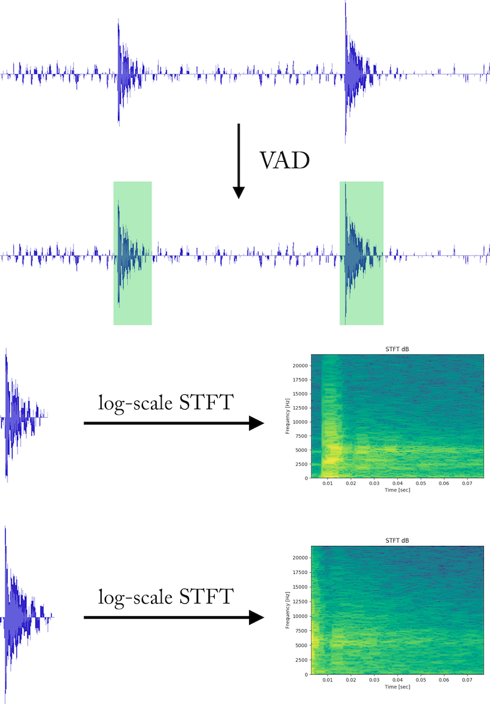

# Complex Indoor Environment Sound Source Localization (CIESSL)

[](https://travis-ci.com/TooSchoolForCool/CIESSL-py) 

This repo implements a python application which performs sound source localization in complex indoor environment with the help of a microphone array and the knowledge of the room structure. To support processing audio sources (i.e., microphone array, wave file ...), a python package [voice_engine](#21-voice-engine) has been developed.

*Note: This repo is developed under **ubuntu 16.04** with **python 2.7**, other ubuntu distribution may also be compatible.*

## 1. Installation

Before installing this package, several system dependencies need to be installed

```bash
sudo apt-get install python-pyaudio libsamplerate0 portaudio19-dev python-tk python-opencv
sudo pip install wheel
```

Then [PyTorch](https://pytorch.org) needs to be installed, for the use of [ciessl_app](ciessl_app). In this repo, we adopt PyTorch-0.4.1. Try following command to install the PyTorch

```bash
pip install http://download.pytorch.org/whl/cpu/torch-0.4.1-cp27-cp27mu-linux_x86_64.whl
pip install torchvision
```

Then use following command to install this package

```bash
python setup.py bdist_wheel
pip install dist/*.whl
```

## 2. Package Information

To support our sound source localization solution, several python packages have been implemented. Below is a brief introduction to every package we developed. 

### 2.1 Voice Engine

[voice_engine](voice_engine) is a python package that handles audio sources processing. It includes acquiring data from a microphone array, reading/writing data from/to a .wav file, resampling signal data, Voice Activity Detection (VAD) and Short Time Fourier Transform (STFT).

## 3. CIESSL

### 3.1 Voice Signal Processing

While reading in voice signal data, Voice Activity Detection (VAD) is performed. We then trim out the active voice segment, and a log-scale Short Time Fourier Transform (STFT) is applied to the active voice segment. Finally, we can convert a 1 dimensional voice signal into  2 dimensional spectrogram in Time Frequency (TF) domain.

